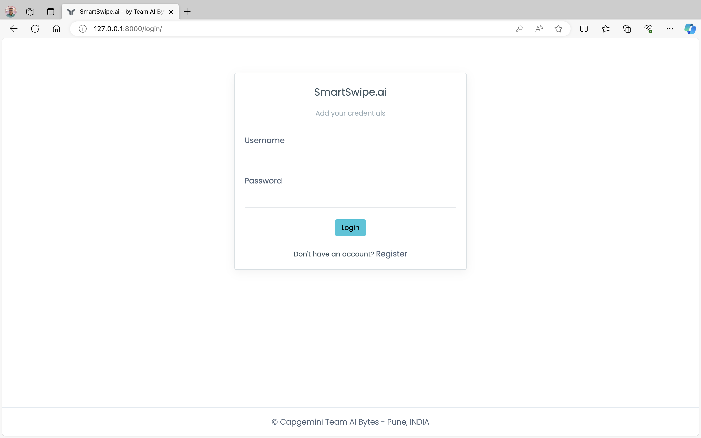
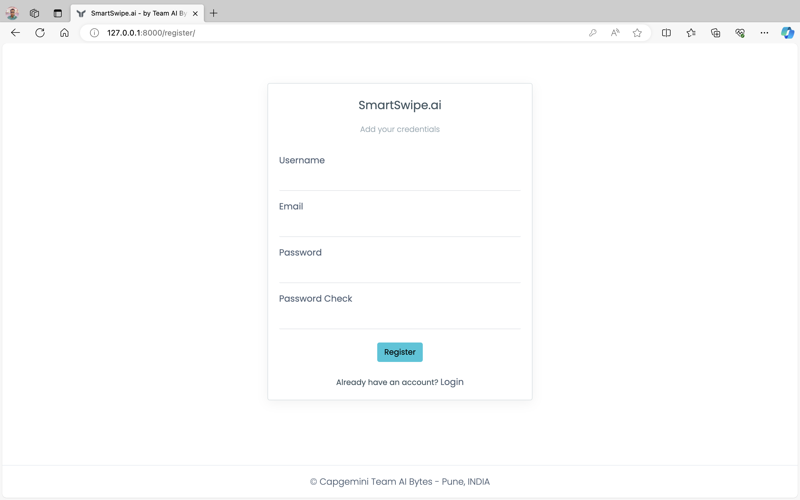
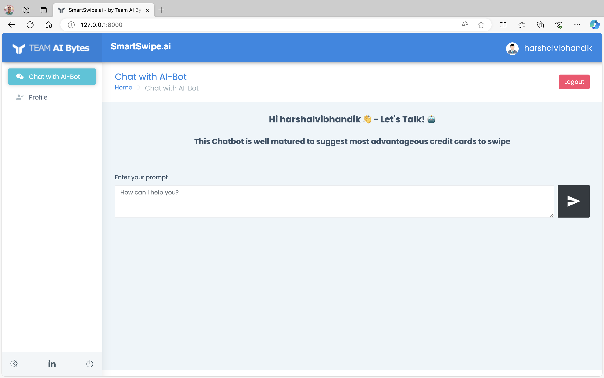
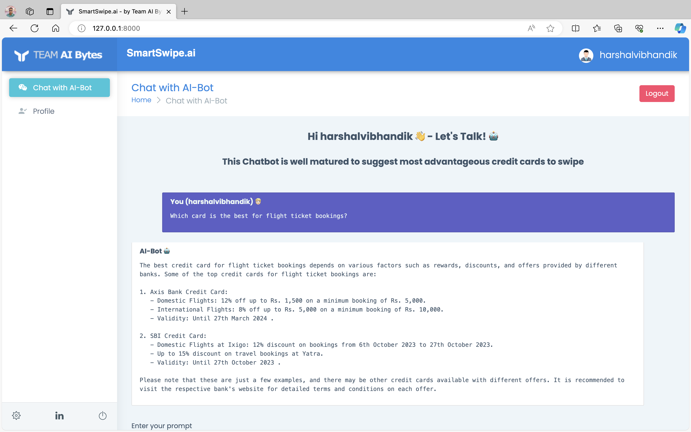
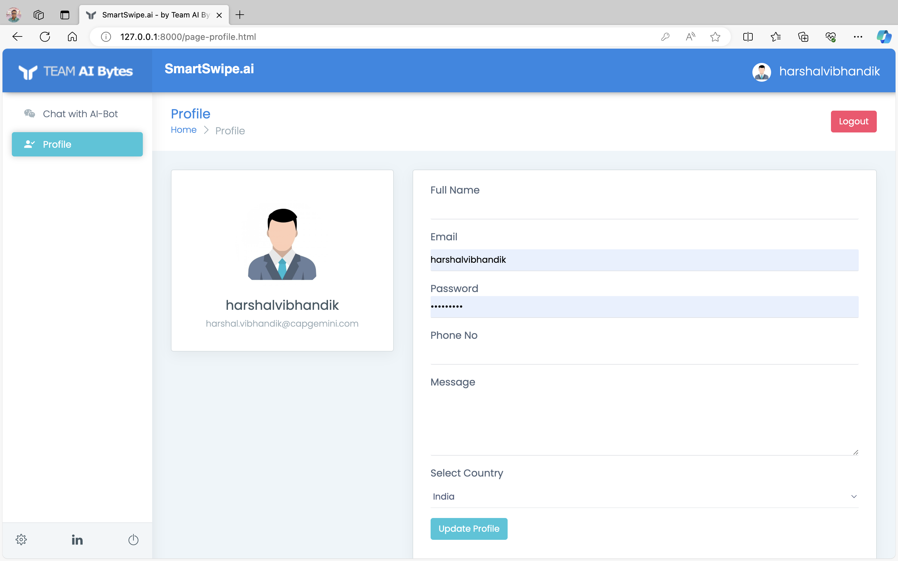

# AI-Bytes-Smart-Swipe

## SmartSwipe.ai

- This is a Generative AI App which helps user to swipe most beneficial credit card for each purchase.
- Also it helps to optimizing spending and enhancing the user shopping experience.

### Capgemini Microsoft A4 Enablement Innovate Hackathon

**Use Case: F-1** How might we integrate real-time credit card reward optimization into the existing contactless payment process
to enhance user experience?

In the financial industry, numerous credit cards offer various plans and rewards. Navigating these options can be
cumbersome and time-consuming for customers, making it challenging to maximize benefits. Generative AI presents a
solution to simplify this process, seamlessly integrating with existing contactless payment methods. This tool can
inform users about the best card to use for each purchase, optimizing spending and enhancing the user experience. By
analyzing the rewards of each credit card in real-time, it suggests the most advantageous option, whether it's earning
travel points or cashback. This would not only enhance the shopping experience but also contribute to better financial
management, ensuring that consumers are making the most of their spending in alignment with their financial strategies
and goals.

**Parameters:**

- Prioritize user privacy and ensure compliance with financial regulations and data protection laws.
- Ensure compatibility with a wide range of credit cards and banks to maximize applicability.
- Incorporate elements that enhance user engagement and trust in the application's recommendations.
- Consider how the application can contribute to users' overall financial well-being beyond immediate rewards.
- Explore potential integrations with emerging technologies like smart wearables or AR/VR interfaces.
- Implement a feedback mechanism for users to provide input on recommendations and app functionality, facilitating
  continuous improvement.

## How to build and run the SmartSwipe.ai Django WebApp?

### GitHub and Local Environment

1. Clone the repo from GitHub 
   `git clone https://github.com/github-cloudlabsuser-771/AI-Bytes-Smart-Swipe.git`
2. Setup your Azure API Secrets in OS environment variables 
   `OPENAI_API_KEY` and `SEARCH_KEY`

### Development Environment (`PyCharm` OR `VS Code`)

1. Go to the repo directory path and setup `venv` 
   `python -m venv venv`
2. Activate the `venv` on terminal 
   `source venv/bin/activate`
3. Install all required dependencies for project 
   `pip install -r requirements.txt`
4. Do the migration to update Django database schema 
   `python manage.py makemigrations`
5. Confirm the migration 
   `python manage.py migrate`
6. Create superuser for Admin access 
   `python manage.py createsuperuser`
7. Run the project on localhost 
   `python manage.py runserver` &emsp;&emsp;&emsp; It will run web app on localhost http://127.0.0.1:8000/

### Screens:

1. Login
   

2. Register
   

3. Chat Dashboard
   

4. AI-Bot response
   

5. Profile
   

6. Dev Team
   

Developed by - **Team AI Bytes** from Capgemini Pune, INDIA.